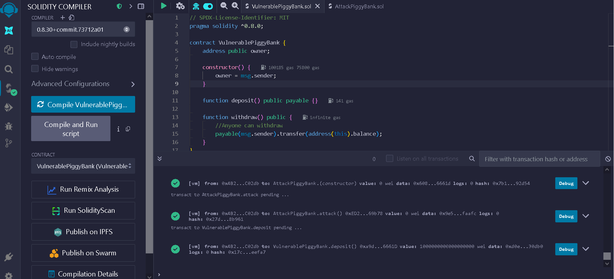
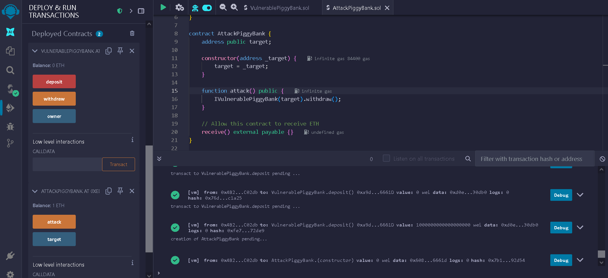

# 🐷 PiggyBank security project

This repository showcases a practical security audit of a simple PiggyBank smart contract. It includes both a vulnerable and a secure implementation, as well as an attacker contract used to simulate and demonstrate how smart contract vulnerabilities can be exploited.

---

## 📄 Contracts overview

### 🔴 VulnerablePiggyBank.sol
A minimal but insecure PiggyBank contract. It lacks access control on sensitive functions, allowing anyone to withdraw the entire balance.

### 🟢 SecurePiggyBank.sol
A properly secured version of the PiggyBank contract. It includes access control mechanisms to ensure that only the owner can withdraw funds.

### ⚔️ AttackPiggyBank.sol
An attacker contract that simulates a real-world exploit. It interacts with the vulnerable contract to demonstrate how funds can be stolen due to missing security checks.

---

## 🎯 Purpose

This project is built for educational purposes. It aims to help developers and auditors:

- Understand common smart contract vulnerabilities
- Learn how to fix them
- Practice writing and testing attack contracts
- Improve overall Web3 security awareness

---

## 🚀 Getting started

You can test and experiment with these contracts using:

- [Remix IDE](https://remix.ethereum.org) (recommended for quick testing)
- Hardhat or Truffle (for advanced testing and automation)

---

## 🧠 What you'll learn

By exploring this repo, you'll be able to:

- Identify and understand common Solidity security pitfalls
- Compare vulnerable and secure code implementations
- Learn how attackers can exploit poor access control
- Apply best practices in smart contract development

---

## 📸 Visual walkthrough

To illustrate the workflow, here are screenshots showing:

### 1. Compiling the vulnerable contract in Remix



### 2. Depositing 1 ETH into the VulnerablePiggyBank & execute the attack with AttackPiggyBank



---

## 📁 Folder structure
```
piggybank-security/
├── contracts/
│ ├── VulnerablePiggyBank.sol
│ ├── SecurePiggyBank.sol
│ └── AttackPiggyBank.sol
├── images/
  ├── piggybank-attack.png
  ├── piggybank-compilecontract.png
└── README.md
```
---

## ⚖️ License

This project is open source and intended strictly for **educational purposes only**. Do not use the vulnerable code in production environments.
